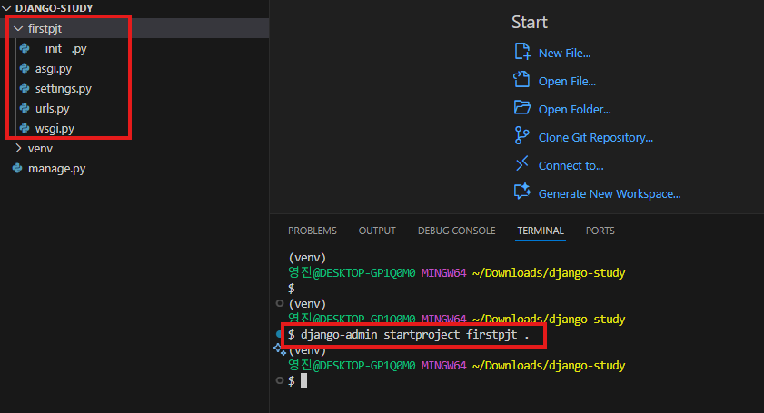
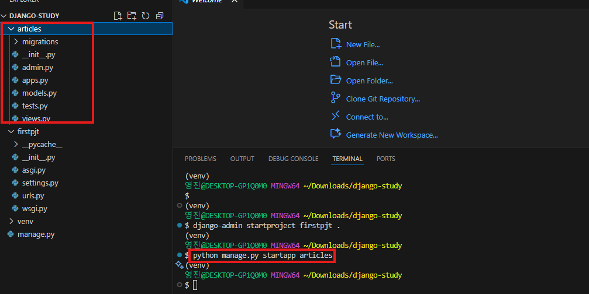
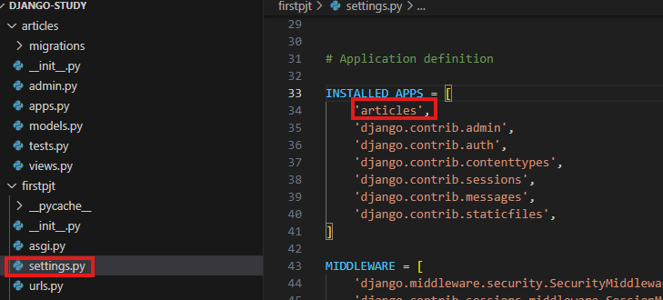
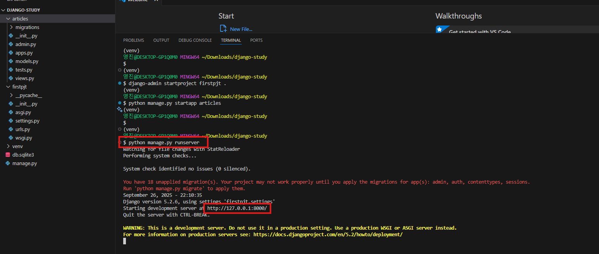
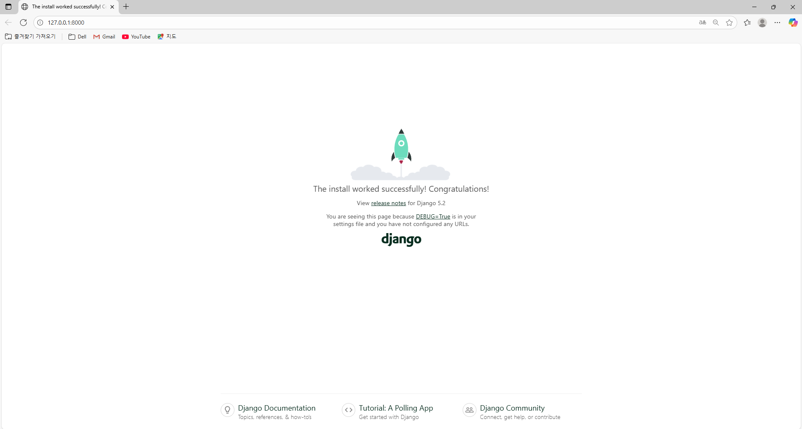

# Django 프로젝트 생성 및 실행

## 1. Django 프로젝트 생성
```bash
django-admin startproject firstpjt .
```


## 2. Django 앱 생성
```bash
python manage.py startapp articles
```


## 3. 앱 등록



## 4. 서버 실행
```bash
python manage.py runserver
```


## 5. 서버 실행 화면

