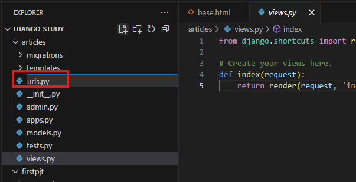

# Django URL 설정 및 동적 페이지 구현

## 1. view 함수 작성

`articles/views.py`에서 함수를 작성합니다.

```python
def index(request):
    return render(request, 'index.html')
```

> 이 함수는 사용자가 호출하면 `index.html`을 보여줍니다.

---


## 2. templates 디렉토리 및 HTML 파일 생성

`articles/templates/` 디렉토리를 생성하고, `base.html`과 `index.html`을 작성합니다.

### base.html
```html
<h1>hello app!</h1>


```

### index.html
```html

```

> `index.html`은 `base.html`을 상속받아 "hello app!" 문구가 표시됩니다.

---


## 3. URL 연결

### articles/urls.py 생성
```python
from django.urls import path
from .views import index

urlpatterns = [
    path('', index, name="index"),
]
```



### 프로젝트 urls.py 수정

`firstpjt/urls.py`에서 `articles/` 경로 요청시 `articles`의 `index` 함수가 호출되도록 설정합니다.


### 서버 실행
```bash
python manage.py runserver
```

> `/articles/` 접속 시 `index.html` 페이지가 정상적으로 표시됩니다.

---


## 4. URL에 숫자 전달 및 동적 페이지 구현

### view 함수 추가 (`views.py`)
```python
def num(request, num):
    context = {
        "num": num,
    }
    return render(request, "num.html", context)
```


### num.html 생성
```html


{{ num }}

```


### urls.py 수정 (`articles/urls.py`)


### 서버 실행 후 확인
```bash
python manage.py runserver
```

> `/articles/123123` 페이지로 접속하면 `num` 값이 정상적으로 출력됩니다.
