# Django Model 정의 및 데이터베이스 연동

## 1. 모델 정의

`articles/models.py`에서 `demo_model`을 정의합니다.

```python
from django.db import models

class demo_model(models.Model):
    num = models.IntegerField()
    destination = models.TextField(max_length=250)
    create_at = models.TimeField(auto_now_add=True)
    update_at = models.TimeField(auto_now=True)
```

| 필드 | 타입 | 설명 |
|-------|------|------|
| num | IntegerField | 정수형 데이터 |
| destination | TextField(max_length=250) | 텍스트 데이터, 최대 250자 |
| create_at | TimeField(auto_now_add=True) | 생성 시간 |
| update_at | TimeField(auto_now=True) | 업데이트 시간 |

---

## 2. 데이터베이스 스키마 생성

```bash
python manage.py makemigrations
python manage.py migrate
```

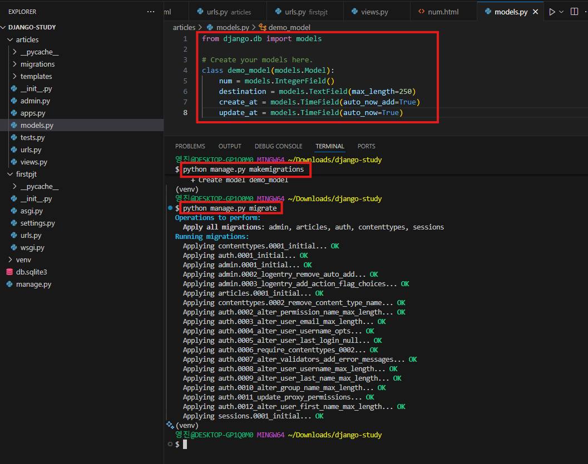

---

## 3. 관리자 계정 생성

```bash
python manage.py createsuperuser
```

`articles/admin.py`에 모델 등록 후 `/admin` 페이지 접속:

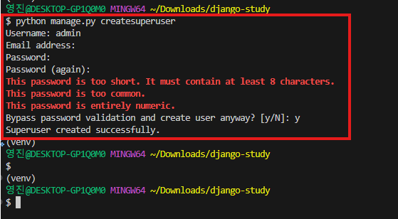
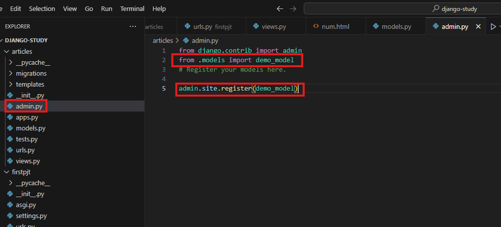

```bash
python manage.py runserver
```
> 로그인 후 demo_model이 표시되는 것을 확인하고, 임의 데이터 추가 가능.
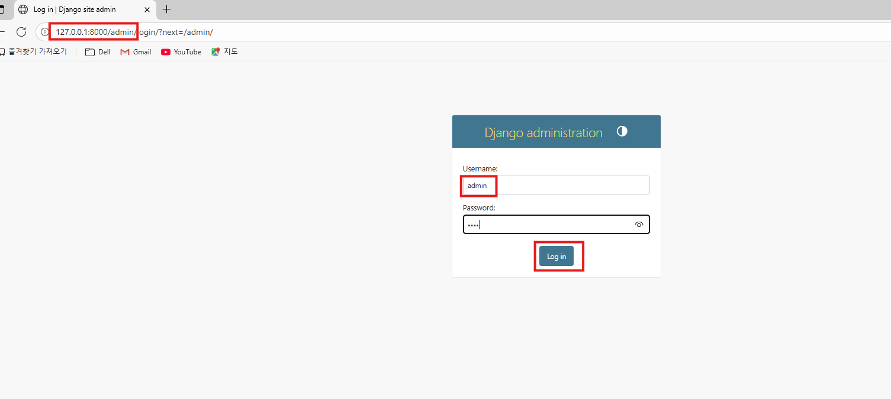
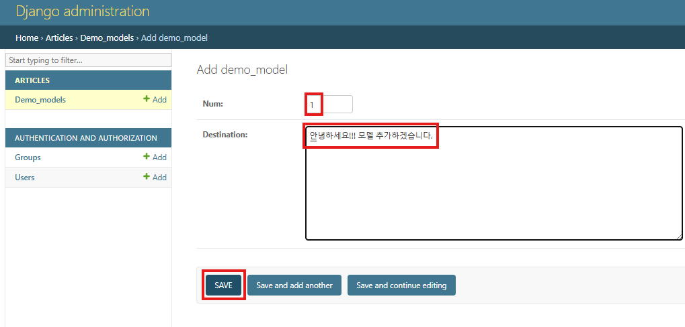
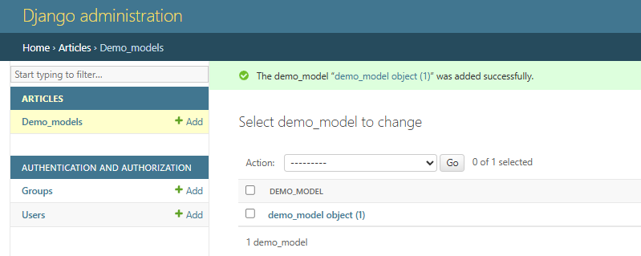
---

## 4. Shell로 데이터 확인 및 생성

### 패키지 설치
```bash
pip install django-extensions ipython
```
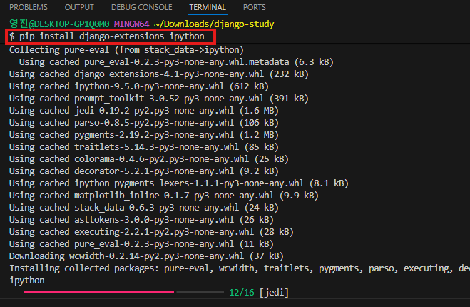

### settings.py 추가


### shell_plus 실행
```bash
python manage.py shell_plus
```

### 데이터 조회
```python
# 모든 데이터 조회
demo_model.objects.all()

# 특정 id 조회
demo_model.objects.get(id=1)
```

### 데이터 생성
```python
# create() 방식
demo_model.objects.create(num=2, destination="안녕하세요")

# save() 방식
demo_obj = demo_model(num=3, destination="안녕하세요2")
demo_obj.save()
```

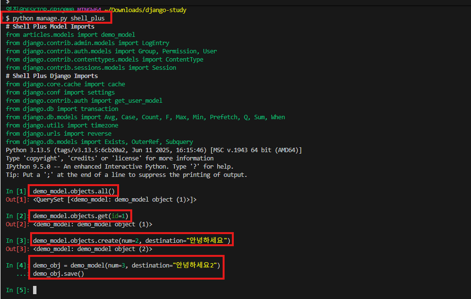

### shell 종료
```python
exit()
```

> `db.sqlite3`에서 데이터 확인 가능.
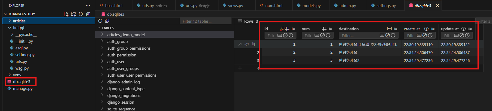
---

## 5. 뷰에서 DB 데이터 사용

### views.py 수정

```python
from django.shortcuts import render
from .models import demo_model

def index(request):
    num_model = demo_model.objects.all()
    context = {
        "num": num_model,
    }
    return render(request, 'index.html', context)

def num(request, num):
    num_model = demo_model.objects.filter(id=num).all()
    context = {
        "num": num_model,
    }
    return render(request, "num.html", context)
```

---

## 6. num.html 수정

```html



<p>{{ value.id }}</p>
<p>{{ value.destination }}</p>


```

---

## 7. index.html 수정

```html



<a href="{{ value.id }}">{{ value.id }}</a>
<br>


```

> `/articles/` 접속 시 DB에 있는 id 목록이 표시되고, 각 id 클릭 시 해당 데이터가 출력됨.

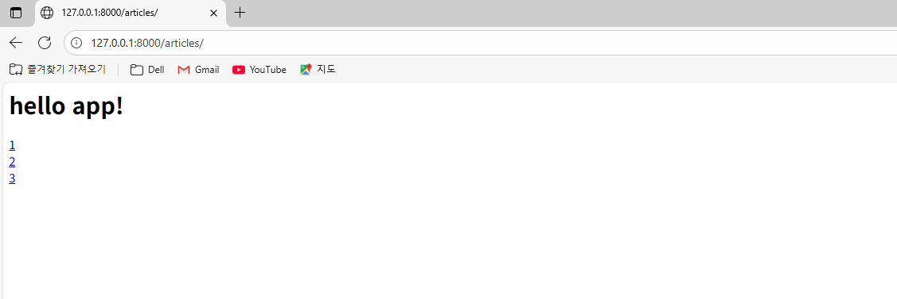
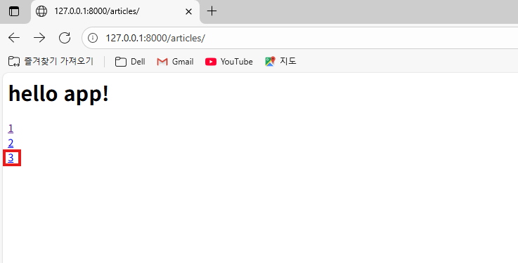
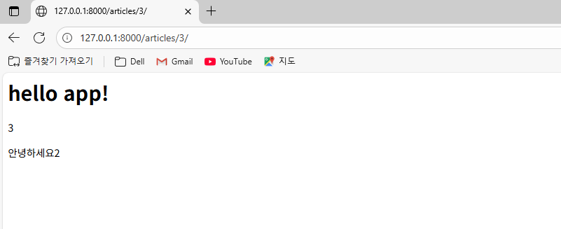