# Django POST 메서드: 생성 및 삭제 구현 + 업데이트 구현

## 1. POST 메서드로 데이터 생성

`views.py`에서 `create` 함수 작성:

```python
def create(request):
    num_model = demo_model()
    num_model.num = request.POST.get('num')
    num_model.destination = request.POST.get('destination')
    num_model.save()
    return redirect('articles:index')
```

- `redirect`를 통해 데이터 생성 후 `index` 페이지로 이동

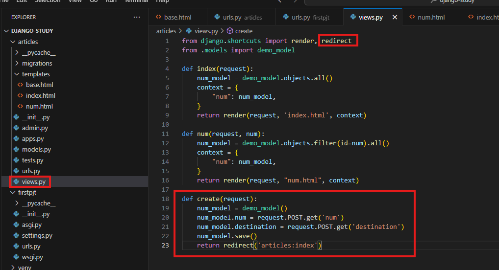

`urls.py`에 path와 app_name 추가:

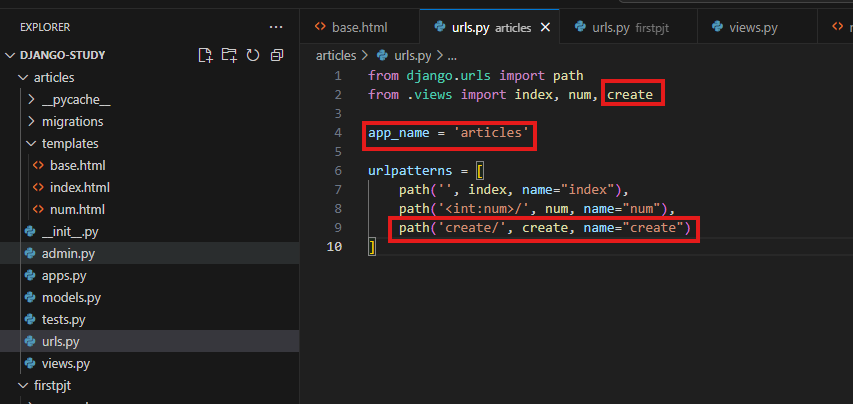

---

## 2. 데이터 생성 폼 추가

`index.html` 안에 해당 내용을 포함합니다.

```html
<form action="" method="POST">
    
    <label for="num">num : </label>
    <input type="text" id="num" name="num">
    <br>
    <label for="content">destination: </label>
    <input type="text" id="destination" name="destination">
    <br>
    <button type="submit">제출</button>
</form>
```

- CSRF 토큰 필수
- 폼 제출 시 `create` 뷰를 호출합니다.

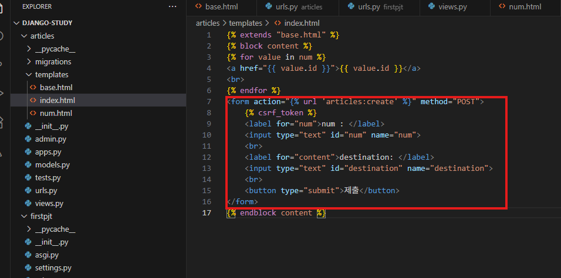

---

## 3. 데이터 삭제 구현

`views.py`에서 `delete` 함수 작성:

```python
def delete(request, num):
    num_model = demo_model.objects.filter(id=num)
    num_model.delete()
    return redirect('articles:index')
```

`urls.py`에 삭제 경로 추가:

```python
path('delete/<int:num>/', delete, name="delete"),
```

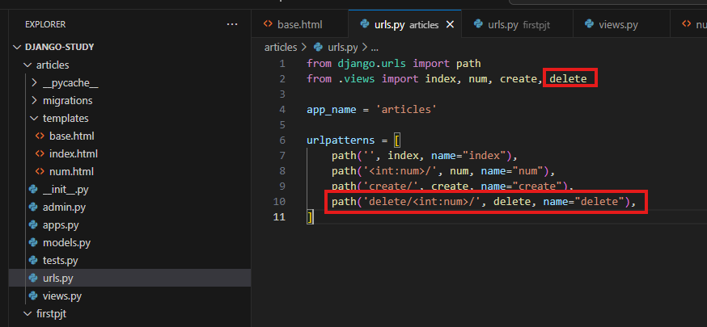

---

## 4. 삭제 버튼 추가

`num.html`에 삭제 버튼 폼 작성:

```html



<p>{{ value.id }}</p>
<p>{{ value.num }}</p>
<p>{{ value.destination }}</p>
<form action="" method="POST">
    
    <button type="submit">삭제</button>
</form>


```

- 각 데이터 항목마다 삭제 버튼 생성
- POST 메서드 사용 및 CSRF 토큰 포함

---

## 5. 서버 실행 및 확인

```bash
python manage.py runserver
```

- 정상적으로 생성 및 삭제 기능 동작 확인 가능

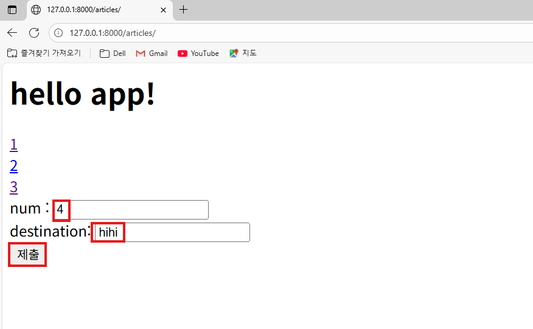
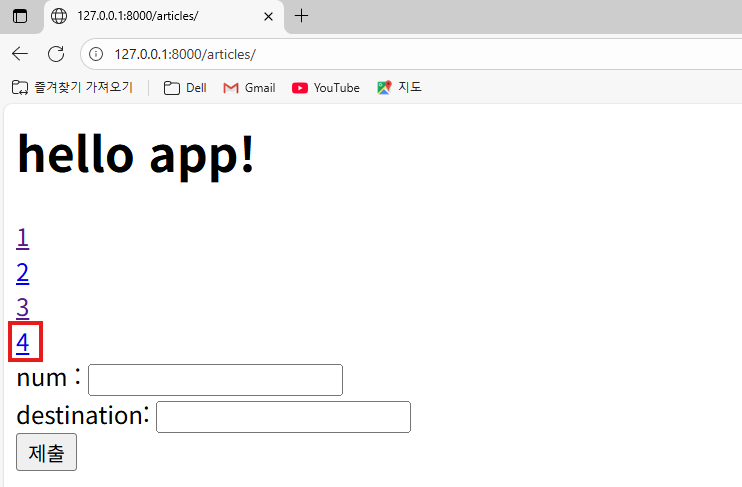
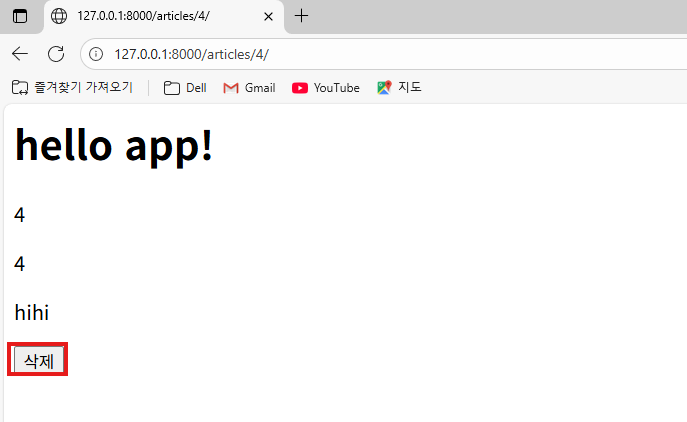
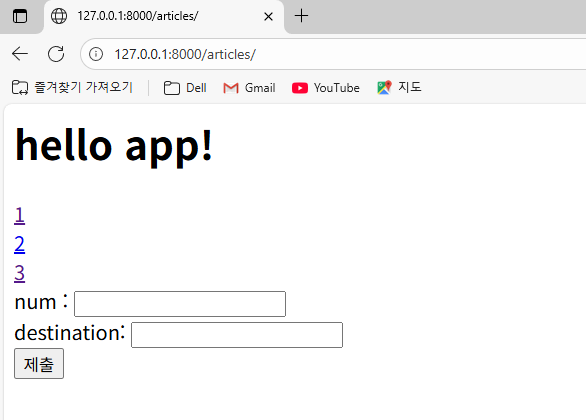

---

## 6. 데이터 업데이트 구현

### 1) `articles/urls.py` 수정
먼저 `articles` 앱의 URL 설정에 `update` 경로를 추가해야 합니다.

```python
    path('update/<int:num>/', update, name="update"),
```
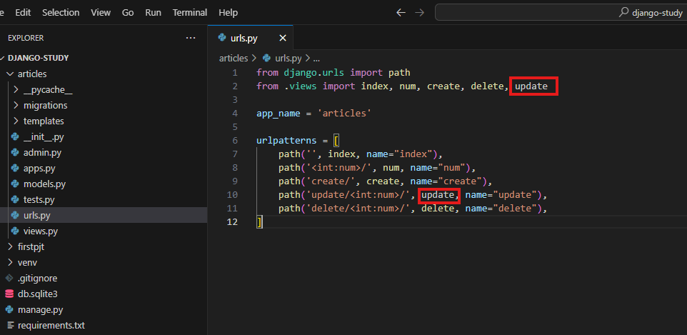

---

### 2) `articles/views.py` 수정
`update` 요청을 처리할 뷰 함수를 추가합니다.  
이 함수는 **GET 요청 시 수정할 데이터를 보여주고, POST 요청 시 데이터를 업데이트**합니다.

```python
def update(request, num):
    num_model = demo_model.objects.get(id=num)

    if request.method == 'POST':
        num_model.num = request.POST.get('num')
        num_model.destination = request.POST.get('destination')
        num_model.save()
        return redirect('articles:num', num=num_model.id)
    else:
        context = {
            'num': num_model,
        }
        return render(request, 'update.html', context)
```

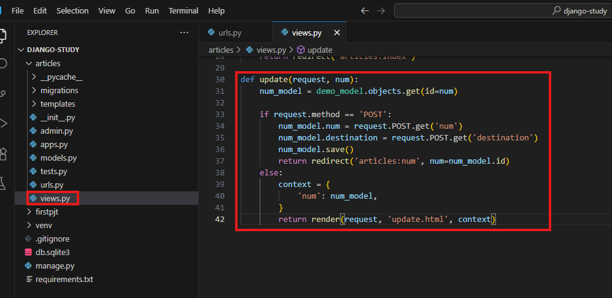

---

### 3) `articles/templates/update.html` 생성
데이터를 수정할 수 있는 폼이 있는 새로운 HTML 파일을 생성합니다.

```html



  <h1>게시글 수정</h1>
  <form action="" method="POST">
    
    <label for="num">num : </label>
    <input type="text" id="num" name="num">
    <br>
    <label for="content">destination: </label>
    <input type="text" id="destination" name="destination">
    <br>
    <button type="submit">제출</button>
  </form>

```

---

### 4) `articles/templates/num.html` 수정
상세 페이지(`num.html`)에서 수정 페이지로 이동할 수 있는 링크를 추가합니다.

```html



<p>{{ value.id }}</p>
<p>{{ value.num }}</p>
<p>{{ value.destination }}</p>

<a href="">수정하기</a>
<form action="" method="POST">
    
    <button type="submit">삭제</button>
</form>


```
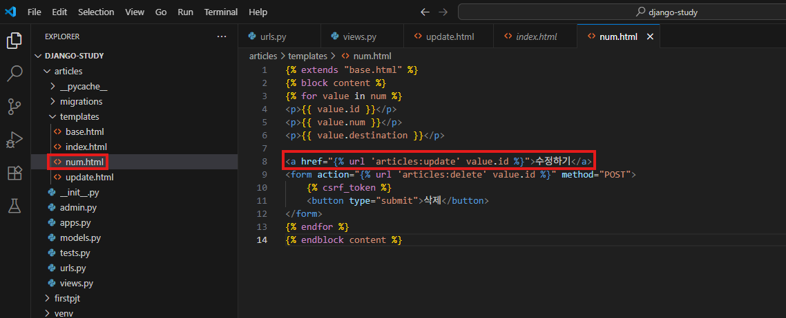

### 5). 서버 실행 및 확인

```bash
python manage.py runserver
```

- 정상적으로 업데이트 동작 확인 가능

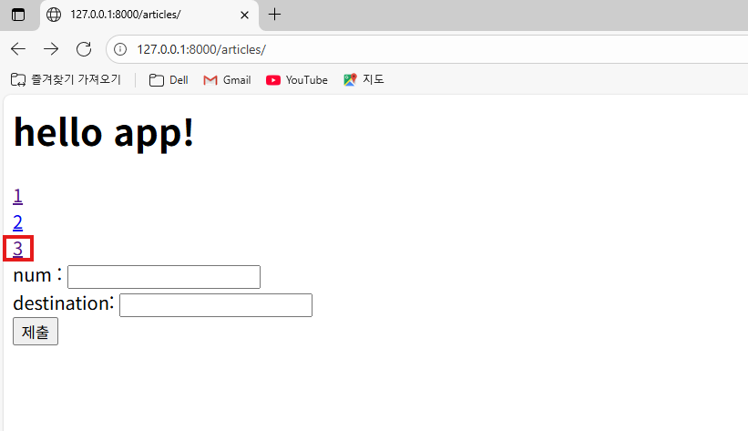
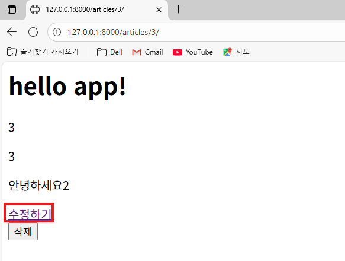
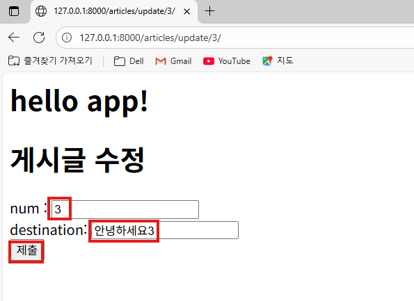
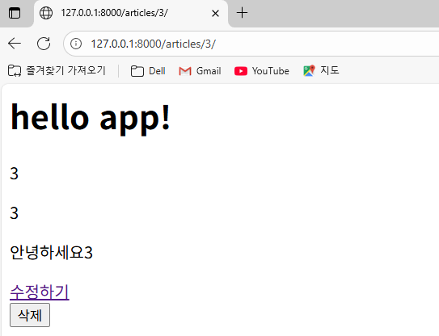