## django static, media

### STATIC_URL
- 기본 경로 및 추가 경로에 위치한 정적 파일을 참조하기 위한 URL

### STATICFILES_DIRS
- 정적 파일의 기본 경로 외에 추가적인 경로 목록을 정의하는 리스트

### Media Files
- 사용자가 웹에서 업로드하는 정적 파일

### MEDIA_ROOT
- 미디어 파일들이 위치하는 디렉토리의 절대 경로

### MEDIA_URL
- MEDIA_ROOT에서 제공되는 미디어 파일에 대한 주소를 생성

---

### 1. STATIC, MEDIA 경로 설정
```python
STATIC_URL = '/assets/'
STATICFILES_DIRS = [
    BASE_DIR / 'assets',
]

MEDIA_URL = '/uploaded_files/'
MEDIA_ROOT = BASE_DIR / 'uploaded_files'
```
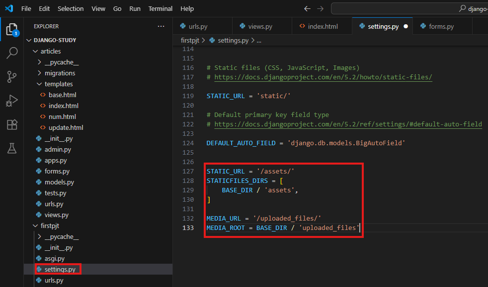

### 2. STATIC, MEDIA 디렉토리 생성
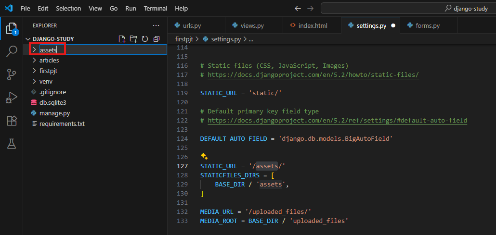
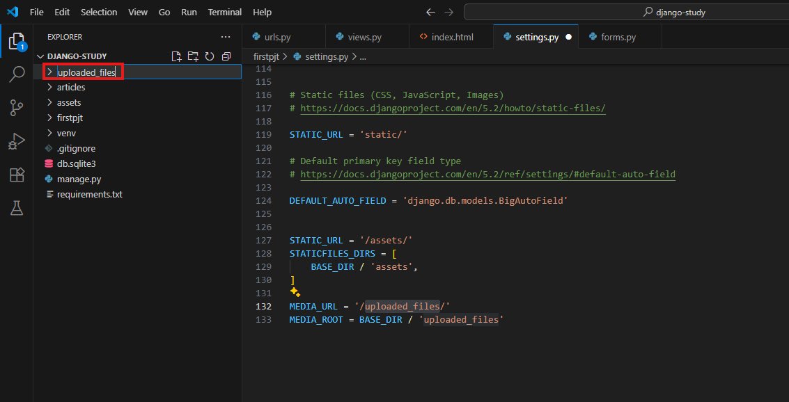

### 3. assets 경로 이미지 업로드
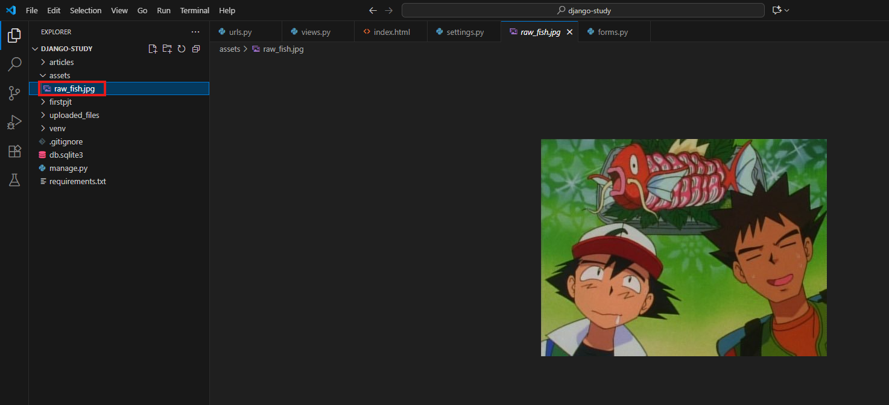

### 4. articles/templates/index.html 수정
```django
<br>

    
```
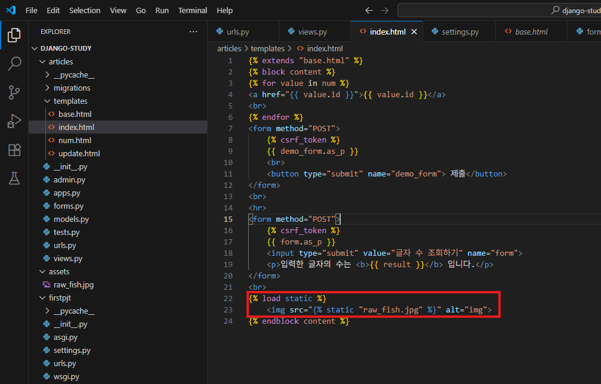

### 5. 서버 실행 및 확인

```bash
python manage.py runserver
```
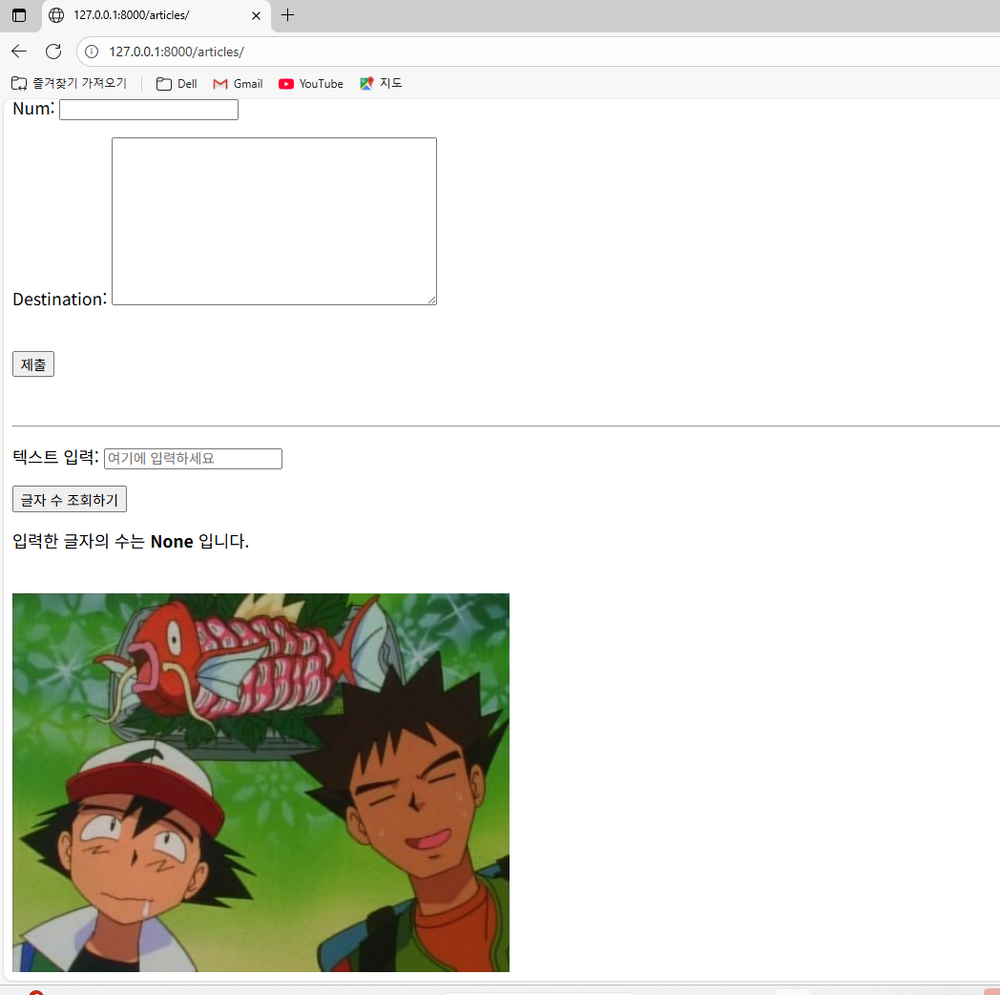

### 5. model 생성
```python
class Article(models.Model):
    image = models.ImageField(blank=True) # upload_to='' 옵션을 사용할 경우 MEDIA_ROOT 경로 아래에 upload_to에 지정한 폴더를 자동으로 생성하고 그 안에 파일을 저장한다.
    image_description = models.TextField()
    created_at = models.DateTimeField(auto_now_add=True)
```
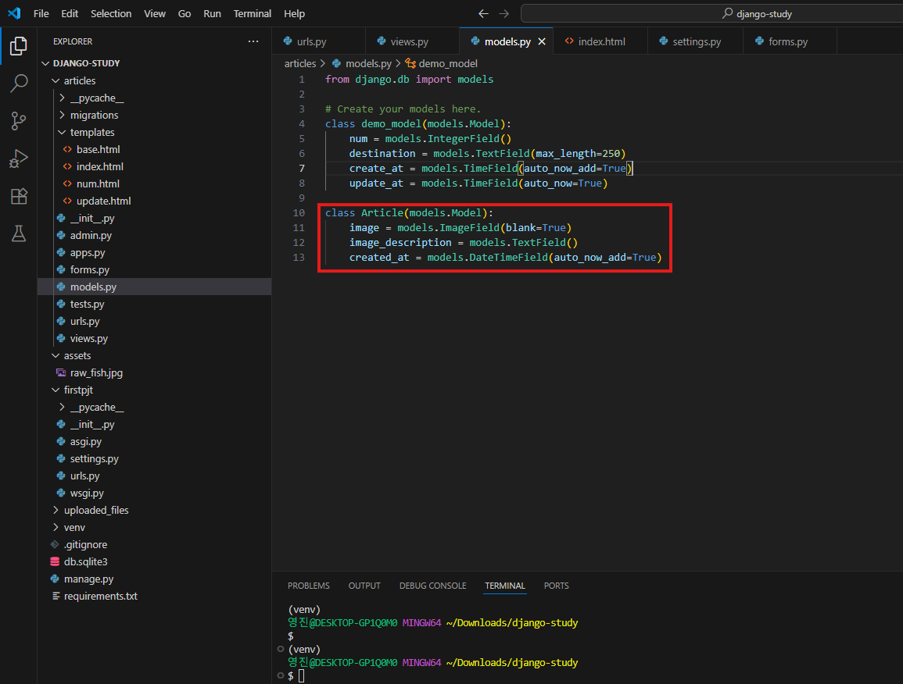

```shell
python -m pip install Pillow
python manage.py makemigrations
python manage.py migrate
```
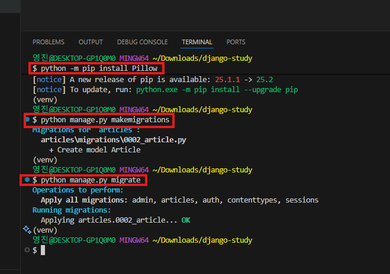

### 6. form 생성
```python
class ArticleForm(forms.ModelForm):
    class Meta:
        model = Article
        fields = '__all__' 
```
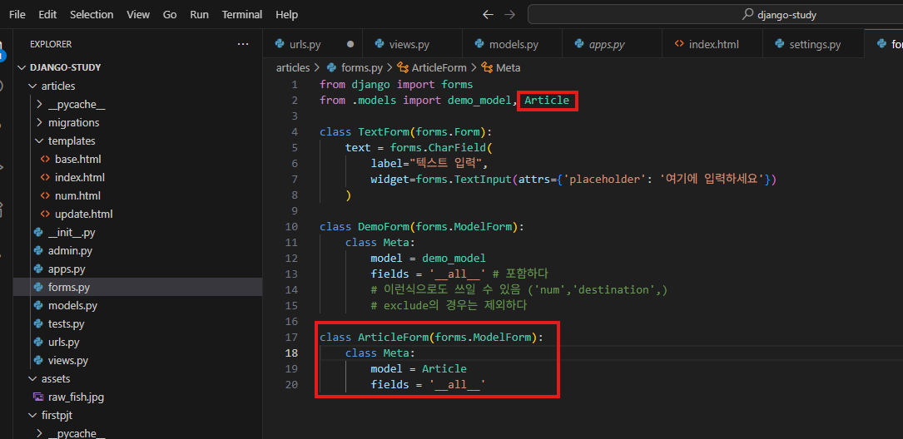

### 7. firstpjt/urls.py 수정
```python
from django.conf import settings
from django.conf.urls.static import static


] + static(settings.MEDIA_URL, document_root=settings.MEDIA_ROOT)
```
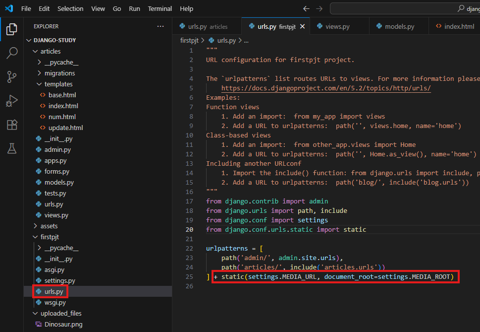

### 8. views.py에서 index 함수 수정
```python
def index(request):
    num_model = demo_model.objects.all()
    articles = Article.objects.all()
    result = None
    form = TextForm()
    demo_form = DemoForm()
    article_form = ArticleForm()

    if request.method == "POST":
        if 'form' in request.POST:
            form = TextForm(request.POST)
            if form.is_valid():
                result = len(form.cleaned_data['text'])
        elif 'demo_form' in request.POST:
            demo_form = DemoForm(request.POST)
            if demo_form.is_valid():
                demo_form.save()
                return redirect('articles:index')
        elif 'article_form' in request.POST:
            article_form = ArticleForm(request.POST, request.FILES)
            if article_form.is_valid():
                article_form.save()
                return redirect('articles:index')

    context = {
        "num": num_model,
        "articles": articles, 
        "form": form,
        "result": result,
        "demo_form": demo_form,
        "article_form": article_form,
    }
    return render(request, 'index.html', context)
```
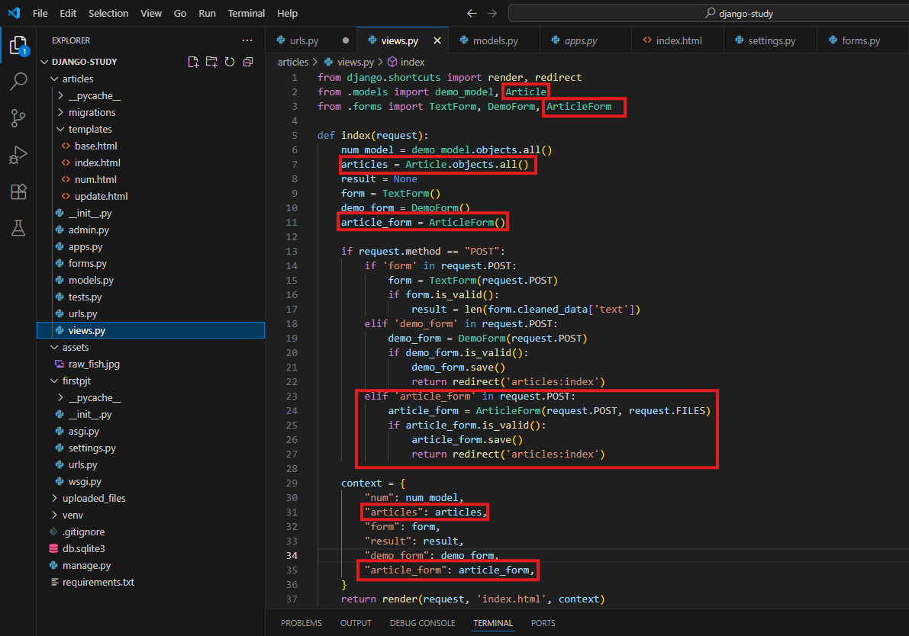

### 9. index.html 수정
 위에 기입합니다.
```django
  <h3>이미지 업로드</h3>
  <form method="POST" enctype="multipart/form-data">
      
      {{ article_form.as_p }}
      <button type="submit" name="article_form">이미지 제출</button>
  </form>

  <hr>

  <h3>업로드된 사진</h3>
  
    <div>
        
            
        
        <p>설명: {{ article.image_description }}</p>
        <small>업로드 시간: {{ article.created_at }}</small>
    </div>
    <br>
  
```

### 10. 서버 실행 및 확인

```bash
python manage.py runserver
```
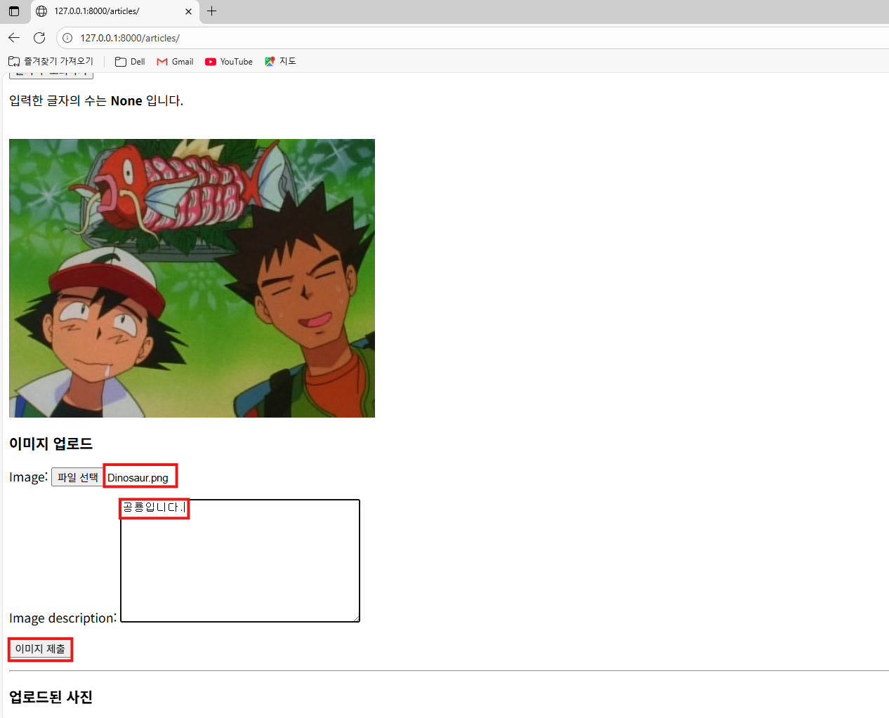
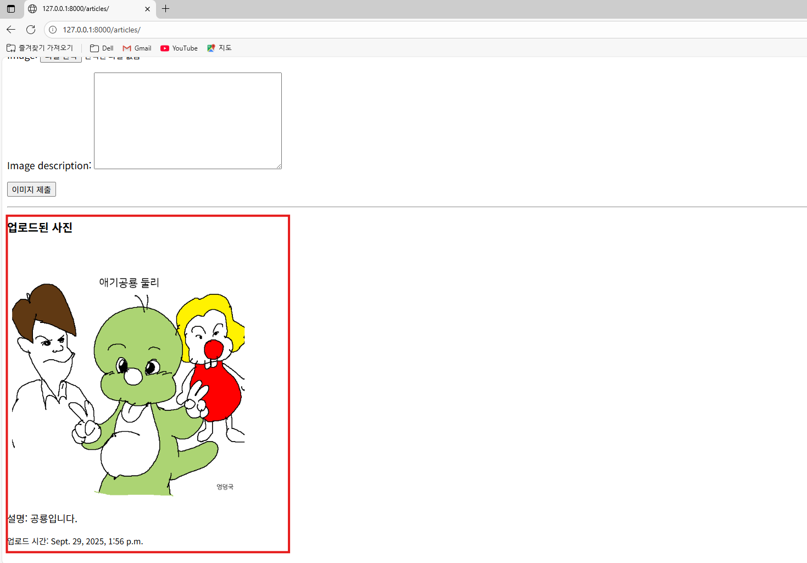