# Accounts 앱 생성 및 로그인 기능 구현

## 1. Accounts 앱 생성
```bash
python manage.py startapp accounts
```
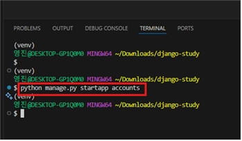

## 2. 프로젝트 설정 변경

### 2-1. URL 연결
`firstpjt/urls.py` 에 다음 경로를 추가합니다.
```python
path('accounts/', include('accounts.urls'))
```
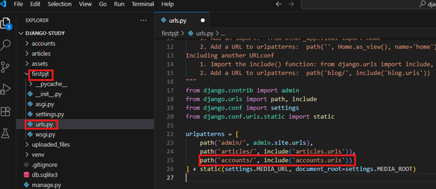

### 2-2. Installed Apps 등록
`settings.py` 의 `INSTALLED_APPS` 에 `accounts` 를 추가합니다.
```python
'accounts',
```
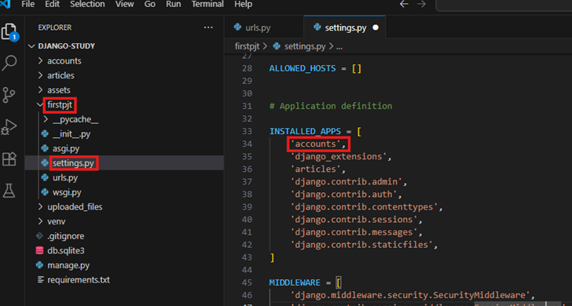

### 2-3. 커스텀 User 모델 생성
`models.py` 에서 `AbstractUser` 를 상속받아 User 모델을 정의합니다.
```python
from django.contrib.auth.models import AbstractUser

class User(AbstractUser):
    pass
```
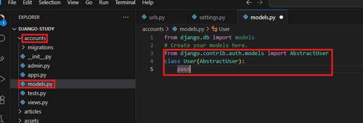

### 2-4. AUTH_USER_MODEL 지정
`settings.py` 에 추가합니다.
```python
AUTH_USER_MODEL = 'accounts.User'
```
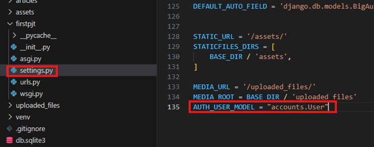

### 2-5. Admin에 등록
`accounts/admin.py` 에서 User 모델을 등록합니다.
```python
from django.contrib import admin
from django.contrib.auth.admin import UserAdmin
from .models import User

admin.site.register(User, UserAdmin)
```
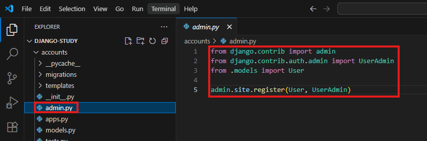

---

## 3. 로그인 페이지 구성

### 3-1. URL 작성
`accounts/urls.py` 에 로그인 경로를 작성합니다.
```python
from django.urls import path
from . import views

app_name = 'accounts'

urlpatterns = [
    path('login/', views.login, name='login'),
]
```
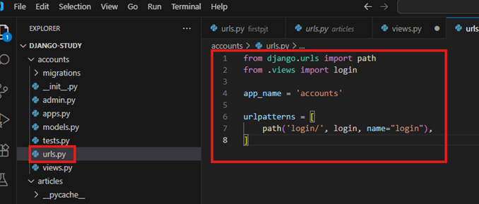

### 3-2. View 작성
`accounts/views.py` 에 로그인 함수를 작성합니다.
```python
from django.shortcuts import render, redirect
from django.contrib.auth.forms import AuthenticationForm
from django.contrib.auth import login as auth_login

def login(request):
    if request.method == "POST":
        form = AuthenticationForm(request, request.POST)
        if form.is_valid():
            auth_login(request, form.get_user())
            return redirect('articles:index')
    else:
        form = AuthenticationForm()
    
    context = {"form": form}
    return render(request, 'login.html', context)
```
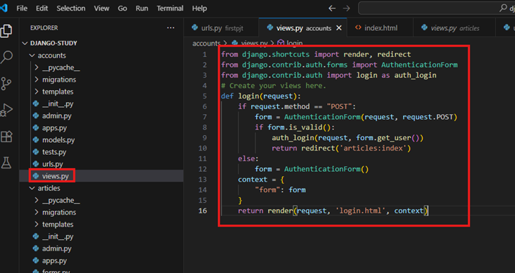

### 3-3. Template 작성
`templates/login.html` 을 생성하고 로그인 폼을 구성합니다.
```html
<h2>로그인</h2>
<form method="post">
    
    {{ form.as_p }}
    <button type="submit">로그인</button>
</form>
```
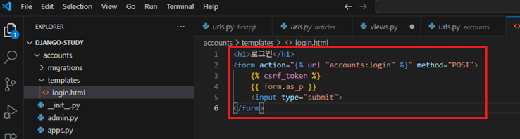

---

## 4. DB 초기화 및 마이그레이션

### 4-1. 기존 마이그레이션 제거
모든 앱의 `migrations/` 폴더 내 `__init__.py` 를 제외한 파일을 제거하고,
`db.sqlite3` 도 삭제합니다.

### 4-2. 마이그레이션 재실행
```bash
python manage.py makemigrations
python manage.py migrate
```
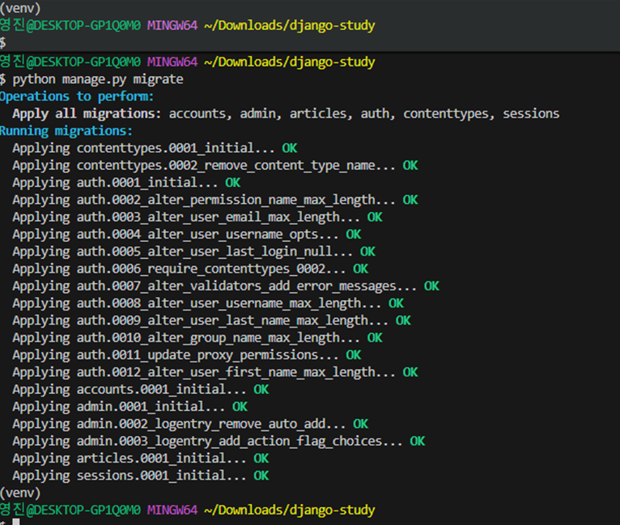

---

## 5. Index 페이지에 로그인 버튼 추가
`articles/templates/index.html` 의 `` 윗부분에 추가합니다.
```html
<a href="">로그인하기</a>
```
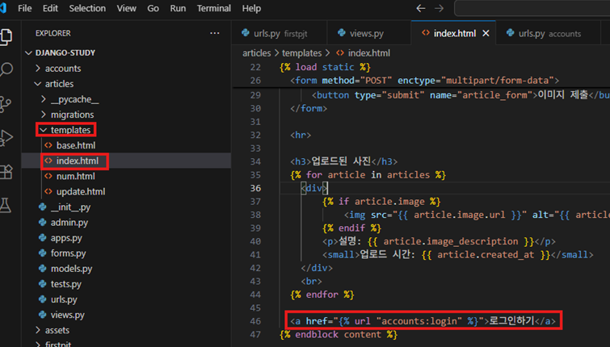

---

## 6. 테스트

1. 새로운 유저 생성  
   ```bash
   python manage.py createsuperuser
   ```

2. 서버 실행 후 `로그인하기` 버튼 클릭

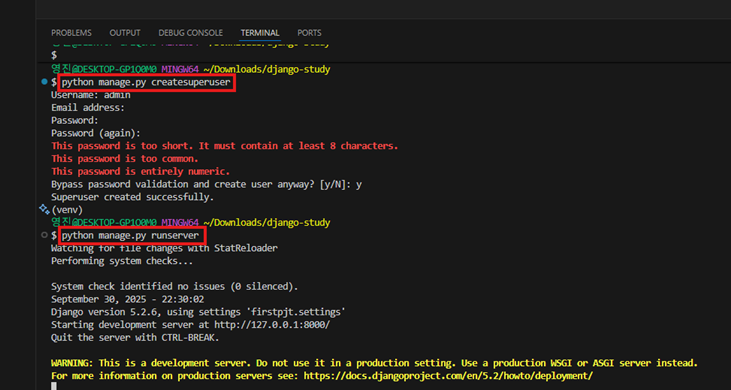
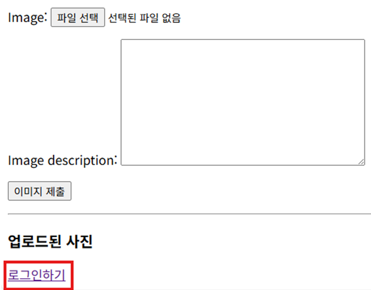

3. 로그인 시도  
   - 실패 시: 에러 메시지 출력  

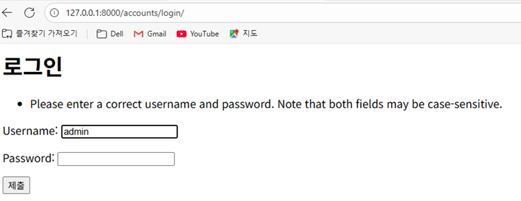

   - 성공 시: `articles:index` 로 리디렉션  

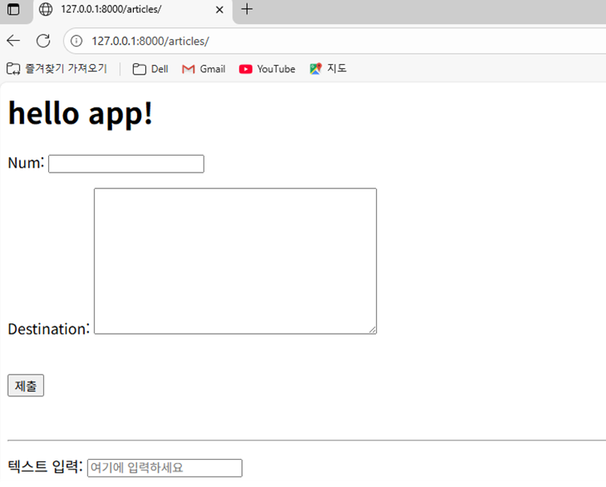
---
