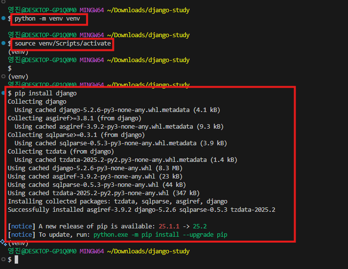

# Django 초기 세팅

## 1. 파이썬 가상환경 생성
```bash
python -m venv venv
```

## 2. 가상환경 활성화
### Windows
```bash
venv\Scripts\activate
```

### Linux / Mac
```bash
source venv/bin/activate
```

## 3. Django 설치
```bash
pip install django
```

## 4. 실습 이미지

